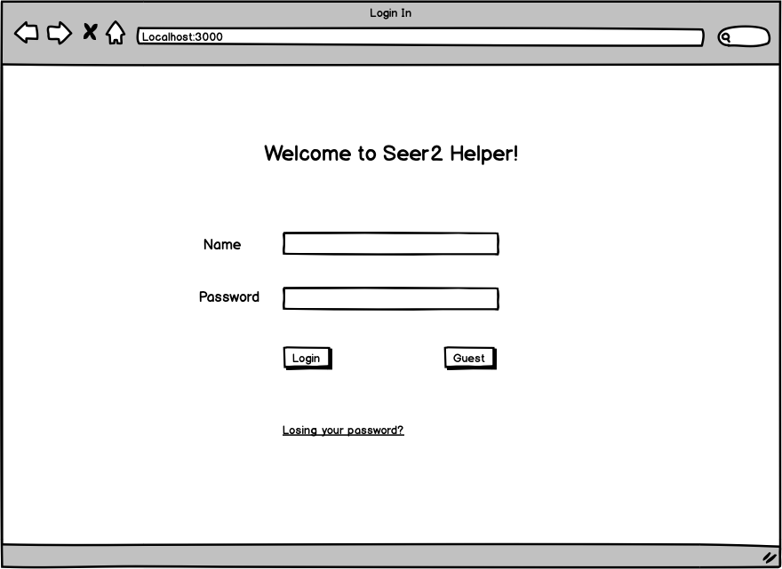
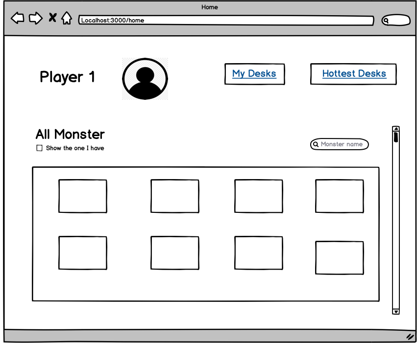
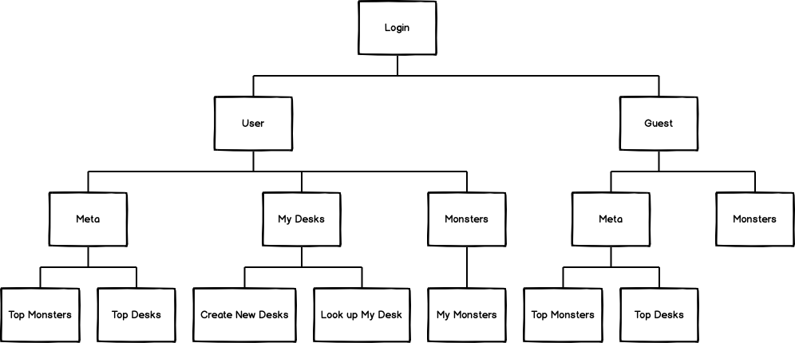

# Online Seer2 Game Helper 

## Overview

Seer2 (The legend of Y. S. ), created by TaoMee Inc, is the one of the most popular managing simulation game in 
China. This free-to-play game, based on its former game Seer 1, allows players to explore in the universe, capture 
and train their monsters and defeat other player's monsters. To better help these players to collect the information 
of their monsters and to build their monster team online. I decide to design the online website.


## Data Model

The application will include Users, Monsters, Team.

* Users can have a list of Monsters they have already collected and a list of Team they manage

* A Team include 6 Monsters.

An Example User:

```javascript
{
  username: "user1", //the name of user
  hash: // a password hash
  salt: // salt used to hash
  user_monsters: // an array of monster the user has collected
  user_teams: // an array of references to Team documents
}
```

An Example Monster:

```javascript
{
  monstername: "Hiro",
  img: "..." // a link to the image of the Monster 
  type: "Fire", // a String of a characterstic of the monsters
}
```


An Example Team with Embedded Monster:

```javascript
{ 
  user: //a ref to user
  name: "Aggro-Buff-Team",
  monsters: [
    //monster object id
  ],
  
}
```


## [Link to Commented First Draft Schema](db.js) 

[db.js](./db.js)

## Wireframes


/ - page for logging in 



/home - page for a user home page and monster list



## Site map

(Better site map in the future)

This is the brief site map of my website.



## User Stories or User Cases

1. as non-registered user, I can log in as guest
2. as non-registered user, I can check the information for Monster
3. as non-registered user, I can register a new account with the site
4. as a user, I can log in to the site
5. as a user, I can look up the Monster List I already hace and update info
6. as a user, I can view all my Team
7. as a user, I can create a new Team


## Research Topics

(4 points) Use a server-side JavaScript library or module that we did not cover in class.

* I am thinking about using some module to manage the monster information.

* So that with this module, I can manage the desk information and reduce reduction in data management.

(3 points) Perform client side form validation using custom JavaScript or JavaScript library.

* It is necessary to check whether users submit a correct form and respond with mistake message after they don't.

(2 points) Use a CSS framework throughout your site, use a reasonable of customization of the framework (don't just use stock.

 * Since my project is with lots of images and user interactions, I think it is necessary to use a CSS framework to make my web page look nice.

 * I am now using tailwindcss.


## [Link to Initial Main Project File](app.js) 

[app.js](./app.js)

## Annotations / References Used

1. https://www.npmjs.com/package/bcrypt
2. https://tailwindcss.com/components
3. https://expressjs.com/en/guide/error-handling.html
4. https://developer.mozilla.org/en-US/docs/Web/HTML/Element/input/checkbox
